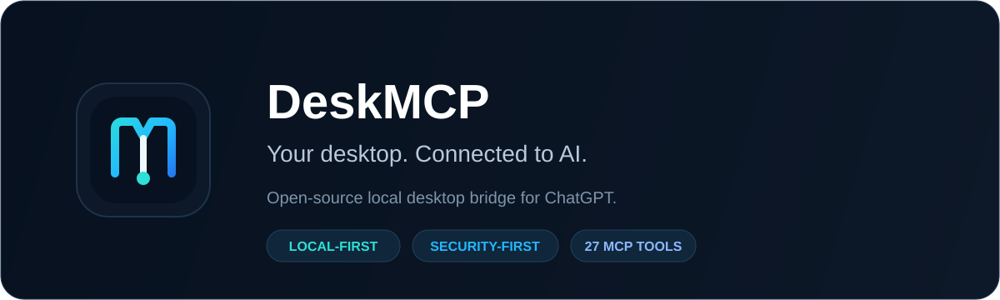
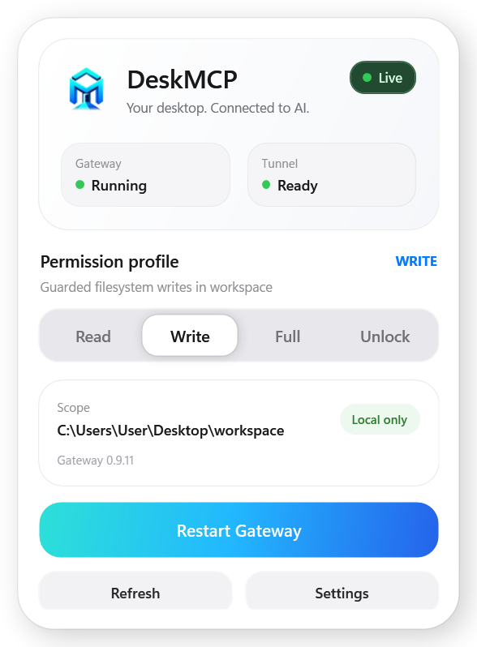
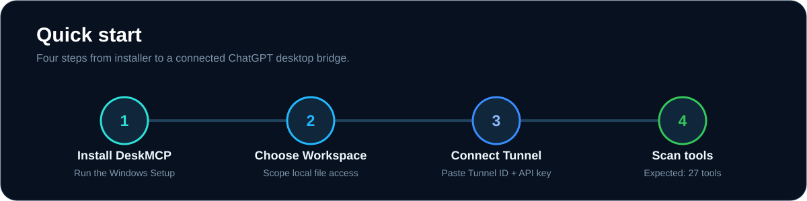
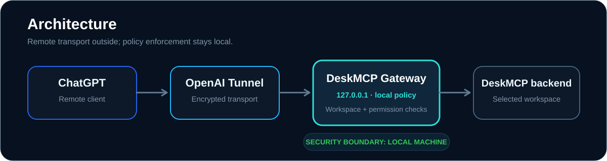

<p align="center">
  
</p>

<p align="center">
  <a href="https://github.com/edmen12/deskmcp/actions/workflows/ci.yml"></a>
  <a href="https://github.com/edmen12/deskmcp/releases/latest"></a>
  
  
  
</p>

# DeskMCP

**DeskMCP is an open-source local desktop bridge for ChatGPT.** It runs a policy gateway on your Windows machine, exposes a stable MCP tool surface, and connects through an OpenAI Tunnel while keeping the local MCP endpoint bound to `127.0.0.1`.

The default profile is **Read-only**. Filesystem access is scoped to a workspace you choose locally, sensitive paths are excluded before search, and elevated process capabilities are session-owned rather than arbitrary PID control.

> **Personal open-source project by [edmen12](https://github.com/edmen12).**

## Why DeskMCP?

| | |
| --- | --- |
| **Local-first** | The Gateway and policy enforcement run on your Windows machine. |
| **Workspace scoped** | File tools stay inside the folder you explicitly select. |
| **Secure by default** | First run starts in Read-only mode; Full Control is never persisted. |
| **Easy to install** | The self-contained Setup does not require Node.js, npm, .NET, Git, or a source checkout. |
## Product preview

<p align="center">
  
</p>

The tray Control Panel shows Gateway/Tunnel health, the active permission profile, the selected workspace, Windows startup settings, and Tunnel configuration without exposing secrets.

## Quick start

<p align="center">
  
</p>

1. Download `DeskMCP-Setup-0.9.0.exe` from the [latest GitHub Release](https://github.com/edmen12/deskmcp/releases/latest) and run it.
2. Choose the workspace DeskMCP may access.
3. In OpenAI Platform, create a Tunnel and copy its **Tunnel ID** and **Runtime API Key** into First Run.
4. In ChatGPT open **Plugins → New plugin**.
5. Use **Name: DeskMCP**, **Connection: Tunnel**, **Auth: No auth**.
6. Select the Tunnel, check **I understand and want to continue**, then **Scan tools**.

Expected result: **13 DeskMCP tools**.

The Runtime API Key is protected with Windows DPAPI and is not written to `settings.json`. You can skip Tunnel setup during First Run and configure it later.
## Architecture

<p align="center">
  
</p>

```text
ChatGPT
  ↕ OpenAI Tunnel
DeskMCP Gateway  (127.0.0.1:8765)
  ↕ local policy enforcement
Desktop Commander
  ↳ selected workspace
  ↳ Gateway-owned process sessions
```

The Tunnel provides the remote transport. The policy decision still happens locally before a filesystem or process action is forwarded to Desktop Commander.

## Permission profiles

- **Read** — default; read, list, metadata and bounded search only.
- **Write** — adds guarded create/edit/write/move operations inside the selected Workspace.
- **Full** — session-only; adds Gateway-owned terminal/process sessions.

`Full` is never persisted. Restarting DeskMCP returns to the last safe persisted profile: **Read** or **Write**.
## Tool surface

DeskMCP currently exposes a stable **13-tool** MCP surface:

```text
desktop_policy_status
desktop_read_file
desktop_list_directory
desktop_get_file_info
desktop_search
desktop_create_directory
desktop_write_file
desktop_edit_file
desktop_move_file
desktop_start_process
desktop_read_process
desktop_interact_process
desktop_terminate_process
```

The schemas stay discoverable across profiles so the remote connection remains stable. **Discoverable does not mean permitted**: every invocation is still checked by the local DeskMCP policy before it can execute.

## Security model

- Gateway HTTP binds only to `127.0.0.1:8765`.
- Allowed filesystem access is restricted to the locally selected Workspace.
- Lexical and canonical path checks block symlink/junction escapes.
- Sensitive paths such as `.env`, `.npmrc`, `.pypirc`, `.netrc`, `.ssh`, `.gnupg`, and `.aws/credentials` are denied by default.
- Search injects sensitive-path exclusions **before** Desktop Commander/ripgrep reads candidate files.- Writes use read-before-write observations and reject stale changes.
- Process tools use opaque Gateway-owned session IDs instead of exposing arbitrary Windows PID control.
- Audit records metadata only; it does not record file contents, terminal input/output, Authorization headers, API keys, or real process PIDs.

User data lives under:

```text
%APPDATA%\DesktopMCP\settings.json
%LOCALAPPDATA%\DesktopMCP\secrets\tunnel-runtime-key.dpapi
%LOCALAPPDATA%\DesktopMCP\logs\audit.jsonl
%LOCALAPPDATA%\DesktopMCP\workspace\
```

These internal paths intentionally retain `DesktopMCP` for upgrade compatibility even though the public product name is **DeskMCP**.

## Tray behavior

- **Quit Control Panel (Keep Services Running)** closes only the UI.
- **Quit DeskMCP** stops the Gateway and any Tunnel process owned by this Panel, then closes the UI.
- Externally managed Tunnel processes are not killed by DeskMCP.

Uninstall removes program files. Settings, secrets, logs and the default Workspace are kept unless the user explicitly chooses to purge user data.

## Developer workflow

End-user requirements and source-development requirements are intentionally separate.
```powershell
npm.cmd ci --ignore-scripts
npm.cmd test
powershell.exe -NoProfile -ExecutionPolicy Bypass -File .\control-panel\wpf\validate.ps1
```

For local development, `control-panel\wpf\launch.cmd` builds the Gateway and .NET 10 Control Panel, then starts the current development build.

Build the complete Windows release with:

```cmd
scripts\build-installer.cmd
```

The release pipeline performs Gateway build, self-contained WPF publish, production-only dependency install, third-party license inventory/notices generation, stage smoke, 13-tool validation, Single Instance validation, orphan/lock checks, branded Setup compilation, install → upgrade → runtime → uninstall smoke, and final release metadata generation.

Generated artifacts live under ignored `runtime\release\` and should be attached to GitHub Releases instead of committed.

## Release verification

A completed release build writes `SHA256SUMS.txt` and `release-manifest.json` beside the final installer.

```powershell
Get-FileHash .\runtime\release\DeskMCP-Setup-0.9.0.exe -Algorithm SHA256
```

Compare the result with `SHA256SUMS.txt` before running an unsigned build.
## Current limitations

- Windows x64 only; ARM64 is not packaged in 0.9.0.
- No automatic updater yet.
- The open-source Setup may be distributed unsigned; Windows can show **Unknown Publisher / SmartScreen** warnings until Authenticode signing is added.
- Some transitive npm dependencies emit deprecation warnings even though the current production `npm audit` reports zero vulnerabilities.

## Project files

- [`SECURITY.md`](SECURITY.md) — vulnerability reporting and security boundaries
- [`CONTRIBUTING.md`](CONTRIBUTING.md) — contribution workflow
- [`CHANGELOG.md`](CHANGELOG.md) — project changes
- [`RELEASE_CHECKLIST.md`](RELEASE_CHECKLIST.md) — release QA
- [`THIRD_PARTY_NOTICES.md`](THIRD_PARTY_NOTICES.md) — bundled dependency licensing
- [`docs/USER_GUIDE.md`](docs/USER_GUIDE.md) — illustrated installation and usage guide
- [`docs/TROUBLESHOOTING.md`](docs/TROUBLESHOOTING.md) — common setup and recovery paths
- [`docs/BRAND.md`](docs/BRAND.md) — DeskMCP visual identity and brand rules

## License

DeskMCP is licensed under the **Apache License 2.0**. See [`LICENSE`](LICENSE).

Third-party components retain their own licenses; see `THIRD_PARTY_NOTICES.md` and the license files bundled with the release.

---

<p align="center">Built as a personal open-source project by <a href="https://github.com/edmen12">edmen12</a>.</p>