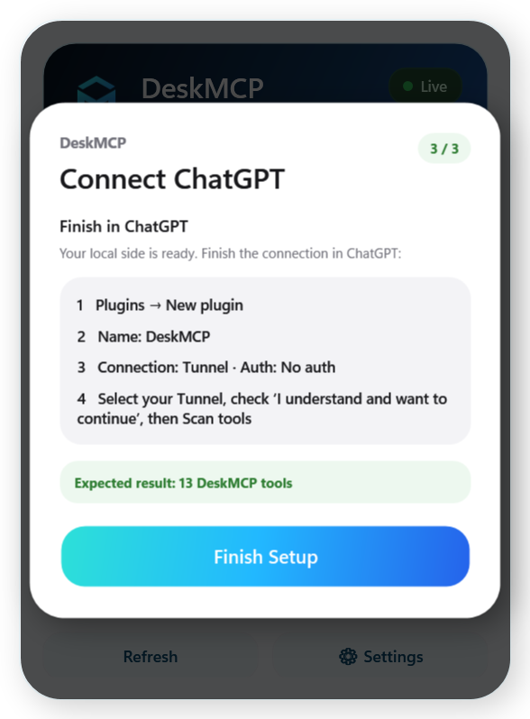

# DeskMCP User Guide

<p align="center"></p>

DeskMCP connects ChatGPT to a Windows desktop through an OpenAI Tunnel while keeping policy enforcement local. This guide covers installation, First Run, permission profiles, tray behavior, and common recovery steps.

## 1. Install

1. Download `DeskMCP-Setup-0.9.0.exe` from the GitHub Release.
2. Run the installer for the current Windows user. Administrator access is not required.
3. Keep **Start DeskMCP with Windows** enabled if you want the tray app to start automatically after sign-in.
4. Keep **Open DeskMCP after installation** enabled for the easiest first setup.

The installer is self-contained. End users do not need Node.js, npm, .NET, Git, or the source repository.

> The open-source build may be unsigned. Windows can show **Unknown Publisher / SmartScreen**. Verify the SHA-256 published with the release before running it.

## 2. First Run

<p align="center"></p>

First Run has three steps: choose a Workspace, configure a Tunnel, then finish the ChatGPT plugin connection.
### Choose a Workspace

DeskMCP filesystem tools can only operate inside the folder selected here. Use a dedicated project or working folder rather than an entire drive. You can change the Workspace later in **Settings**.

### Configure the Tunnel

Create a Tunnel in OpenAI Platform, then enter:

- **Tunnel ID**
- **Runtime API Key**

The Runtime API Key is encrypted with Windows DPAPI and is not stored in `settings.json`. You may skip this step and configure it later.

### Connect ChatGPT

In ChatGPT:

1. Open **Plugins → New plugin**.
2. Name it `DeskMCP`.
3. Set **Connection** to `Tunnel`.
4. Set **Auth** to `No auth`.
5. Select your Tunnel.
6. Check **I understand and want to continue**.
7. Run **Scan tools**.

Expected result: **13 DeskMCP tools**.
## 3. Control Panel

<p align="center"></p>

The Control Panel shows Gateway and Tunnel health, the current Workspace, permission profile, and quick access to settings.

### Permission profiles

- **Read** — recommended default. Read/list/metadata/search only.
- **Write** — adds guarded filesystem changes inside the selected Workspace.
- **Full** — adds Gateway-owned process and terminal sessions for the current session only.

Full Control is deliberately not persisted. After DeskMCP restarts, it returns to the last safe persisted Read or Write profile.

### Status colors

- **Green** — Ready / Live.
- **Amber** — connecting or needs attention.
- **Red** — offline or explicit Full Control risk state.
- **Blue/cyan** — DeskMCP brand and normal interactive controls; it does not replace health semantics.

## 4. Tray behavior

- **Quit Control Panel (Keep Services Running)** closes the UI but leaves services running.
- **Quit DeskMCP** stops the Gateway and Tunnel process owned by this Panel, then exits.

Externally managed Tunnel processes are not terminated by DeskMCP.
## 5. Where data is stored

```text
%APPDATA%\DesktopMCP\settings.json
%LOCALAPPDATA%\DesktopMCP\secrets\tunnel-runtime-key.dpapi
%LOCALAPPDATA%\DesktopMCP\logs\audit.jsonl
%LOCALAPPDATA%\DesktopMCP\workspace\
```

The internal `DesktopMCP` directory name is retained for upgrade compatibility.

## 6. Uninstall

Normal uninstall removes application files and shortcuts while keeping settings, secrets, logs, and the default Workspace. Choose the explicit data-removal option only when you also want to purge DeskMCP user data.

A custom external Workspace is not deleted by the uninstaller.

## 7. Verify a release

The release includes `SHA256SUMS.txt`. In PowerShell:

```powershell
Get-FileHash .\DeskMCP-Setup-0.9.0.exe -Algorithm SHA256
```

Compare the output with the SHA-256 published in the same GitHub Release.